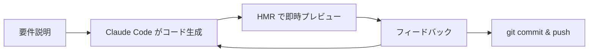

## はじめに

クラウド認定試験（AWS、Azure、GCP）の学習は、多くのエンジニアにとって重要なキャリアステップです。しかし、効率的な学習ツールを見つけるのは意外と難しいものです。

今回は、**Claude Code**（Anthropic の CLI ツール）を活用して、フル機能の学習プラットフォーム「**StudyForge**」を開発した経験を共有します。

:::message
**デモサイト**: https://jackywangsh-studyforge.hf.space
**GitHub**: https://github.com/zixuniaowu/studyforge
:::

## 主な機能

### 1. マルチクラウド対応の問題集

| プロバイダー | 認定試験数 | 問題セット数 |
|-------------|-----------|-------------|
| AWS | 13 種類 | 39 セット |
| Azure | 18 種類 | 54 セット |
| GCP | 14 種類 | 42 セット |

合計 **135 セット**、**4,000 問以上**の問題を収録しています。

### 2. 二つの学習モード

**練習モード**
- 即時フィードバック
- 解説表示
- 間違い自動記録

**模擬試験モード**
- タイマー付き
- 終了後に結果一括表示
- 本番同様の体験

### 3. 間違い問題の自動追跡

IndexedDB を使用して、間違えた問題を自動的に記録。復習機能で効率的に弱点を克服できます。

### 4. 子供向け AI 教室（新機能）

6〜9歳の子供向けに、ゲーム化された AI 学習コースを提供：

- **24 レッスン**の体系的カリキュラム
- **闘関マップ**形式の UI
- **画像分類ゲーム**でドラッグ＆ドロップ学習
- **星とバッジ**のリワードシステム


## 技術スタック

```
フロントエンド
├── React 18 + TypeScript
├── Vite 7（ビルドツール）
├── Tailwind CSS 4.0
├── Zustand（状態管理）
├── Dexie.js（IndexedDB ラッパー）
└── Monaco Editor（コードエディタ）

デプロイ
├── Hugging Face Spaces（静的ホスティング）
└── GitHub Actions（CI/CD）
```

## Claude Code での開発体験

### 良かった点

1. **高速なプロトタイピング**: 複雑なコンポーネントも自然言語で指示するだけで実装
2. **リファクタリング支援**: 「フォントサイズを全体的に大きくして」のような曖昧な指示も理解
3. **デバッグ効率**: エラーメッセージを見せるだけで原因特定と修正案を提示
4. **多言語対応**: 日本語・中国語の UI テキストを同時に生成

### 開発フロー



## 主要コンポーネントの実装例

### コードプレイグラウンド

Monaco Editor を統合した、プロフェッショナルなコードエディタ：

```tsx
// web/src/components/CodeRunner/CodePlayground.tsx
import Editor from '@monaco-editor/react';

export const CodePlayground: React.FC<CodePlaygroundProps> = ({
  code: initialCode,
  language = 'python',
  title,
  colabUrl,
}) => {
  const [code, setCode] = useState(initialCode);

  return (
    <div className="bg-white rounded-xl border shadow-sm">
      <Editor
        height="400px"
        language={language}
        value={code}
        onChange={(value) => setCode(value || '')}
        theme="vs-dark"
        options={{
          fontSize: 15,
          lineHeight: 22,
          minimap: { enabled: false },
          wordWrap: 'on',
          automaticLayout: true,
        }}
      />
    </div>
  );
};
```

### 学習ダッシュボード

Zustand を使った状態管理で、学習進捗をリアルタイム追跡：

```tsx
// web/src/stores/kidsProgressStore.ts
import { create } from 'zustand';
import { persist } from 'zustand/middleware';

interface KidsProgressState {
  totalStars: number;
  level: number;
  completedLessons: string[];
  addStars: (amount: number) => void;
  completeLesson: (lessonId: string) => void;
}

export const useKidsProgressStore = create<KidsProgressState>()(
  persist(
    (set) => ({
      totalStars: 0,
      level: 1,
      completedLessons: [],
      addStars: (amount) => set((state) => ({
        totalStars: state.totalStars + amount,
        level: Math.floor((state.totalStars + amount) / 50) + 1,
      })),
      completeLesson: (lessonId) => set((state) => ({
        completedLessons: [...state.completedLessons, lessonId],
      })),
    }),
    { name: 'kids-progress' }
  )
);
```

## UI/UX の改善ポイント

### フォントサイズの最適化

読みやすさを重視し、全体的にフォントサイズを拡大：

| 要素 | 変更前 | 変更後 |
|------|--------|--------|
| ヘッダータイトル | text-xl | text-2xl |
| セクション見出し | text-lg | text-xl |
| カード説明文 | text-xs | text-sm |
| 統計数値 | text-xl | text-2xl |
| ボタンテキスト | text-sm | text-base |

### カード・ボタンの改善

```tsx
// Before
<button className="rounded-lg p-5 text-sm">

// After
<button className="rounded-xl p-6 text-base">
```

角丸を大きくし、パディングとフォントサイズを増やすことで、クリックしやすく読みやすい UI に。

## デプロイ構成

### Hugging Face Spaces

GitHub Actions で自動デプロイ：

```yaml
# .github/workflows/deploy.yml
name: Deploy to HF Spaces

on:
  push:
    branches: [main]

jobs:
  deploy:
    runs-on: ubuntu-latest
    steps:
      - uses: actions/checkout@v4

      - name: Setup Node.js
        uses: actions/setup-node@v4
        with:
          node-version: '20'

      - name: Build
        run: |
          cd web
          npm ci
          npm run build

      - name: Deploy to HF Spaces
        uses: huggingface/hf-hub@v1
        with:
          repo: jackywangsh/studyforge
          path: web/dist
```

### 静的ファイルのみで動作

バックエンドなしで完全にクライアントサイドで動作：

- **IndexedDB**: ローカルデータ永続化
- **JSON ファイル**: 問題データ（4,000問以上）
- **localStorage**: 設定・言語preference

## パフォーマンス最適化

### 遅延読み込み

```tsx
// App.tsx
const KidsCoursePage = lazy(() => import('./pages/KidsCoursePage'));
const AICodeExamplesPage = lazy(() => import('./pages/AICodeExamplesPage'));

<Suspense fallback={<Loading />}>
  <Routes>
    <Route path="/kids-course" element={<KidsCoursePage />} />
    <Route path="/ai-code-examples" element={<AICodeExamplesPage />} />
  </Routes>
</Suspense>
```

### 画像最適化

問題データは JSON で管理し、必要な時のみ fetch：

```tsx
// 初回アクセス時のみ問題データをインポート
useEffect(() => {
  if (exams.length === 0) {
    importExamsFromJSON();
  }
}, []);
```

## 今後の展望

1. **AI チューター機能**: Claude API を使った質問応答
2. **学習分析ダッシュボード**: 詳細な進捗グラフ
3. **コミュニティ機能**: 問題の共有・議論
4. **PWA 対応**: オフライン学習
5. **音声読み上げ**: アクセシビリティ向上

## まとめ

Claude Code を使うことで、通常なら数週間かかる開発が数日で完了しました。

:::message alert
特に効果が大きかった点：
- **UI コンポーネントの大量生成**が高速
- **多言語対応**が自然言語で指示可能
- **リファクタリング**も「もっと見やすく」で OK
:::

AI アシスタントを活用した開発は、生産性を大幅に向上させます。ぜひ試してみてください！

---

## 関連リンク

- **デモ**: https://jackywangsh-studyforge.hf.space
- **GitHub**: https://github.com/zixuniaowu/studyforge
- **Claude Code**: https://claude.ai/code
- **前回の記事**: https://zenn.dev/wangsh/articles/d3b1fb4b35e253
